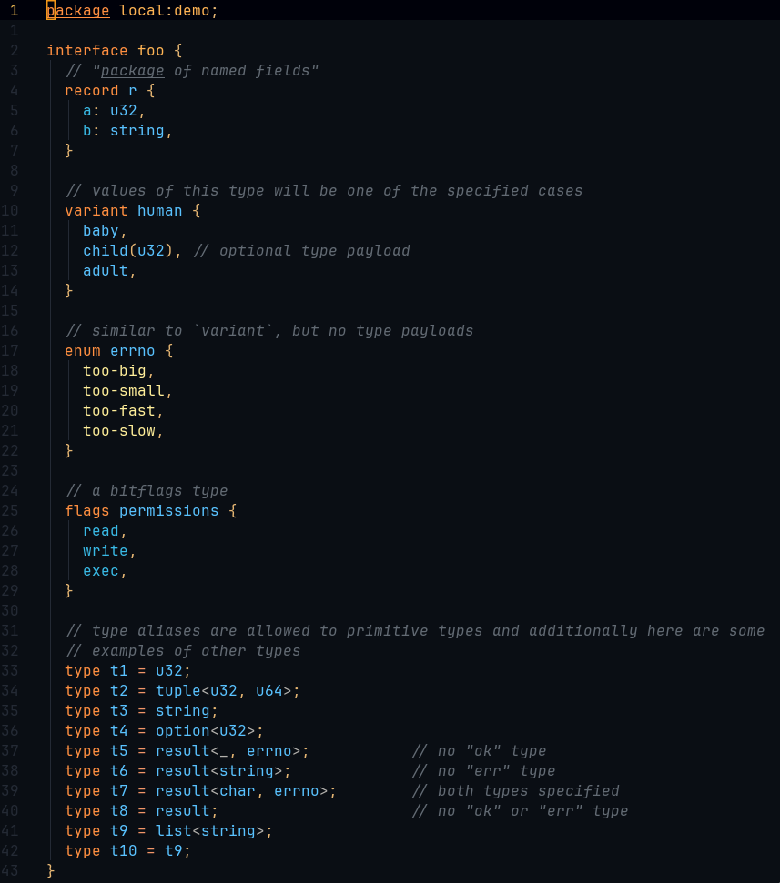

# tree-sitter-wit

[![CI][ci]](https://github.com/liamwh/tree-sitter-wit/actions/workflows/ci.yml)
[![discord][discord]](https://discord.gg/w7nTvsVJhm)
[![matrix][matrix]](https://matrix.to/#/#tree-sitter-chat:matrix.org)

WebAssembly Interface Types (WIT) grammar for [tree-sitter](https://github.com/tree-sitter/tree-sitter).

For an infographic of the [WIT spec](https://github.com/WebAssembly/component-model/blob/main/design/mvp/WIT.md), please see the [WIT Cheatsheet](https://cosmonic.com/downloads/WIT-Cheatsheet-v1.2.pdf) by [Cosmonic](https://cosmonic.com/).

## Example



## Installation

### Neovim

Neovim users can use the [nvim-treesitter](https://github.com/nvim-treesitter/nvim-treesitter) plugin to install the grammar.

#### Using [Lazy.nvim](https://github.com/folke/lazy.nvim) package manager

1. Add the following to your Lua configuration:

    ```lua
    return {
      "nvim-treesitter/nvim-treesitter",
      opts = {
          ensure_installed = {
              "wit",
          }
      }
    }
    ```

#### Manual Installation

1. Add the following to your init.lua:

    ```lua
    local parser_config = require "nvim-treesitter.parsers".get_parser_configs()
    parser_config.wit = {
      install_info = {
        url = "https://github.com/liamwh/tree-sitter-wit",
        files = { "src/parser.c" },
        maintainers = { "@liamwh" },
        branch = "main",
      }
    }
    ```

1. Clone the repo
1. Ensure you have just installed
1. Then run `just install-local` from the root of the repo; this will copy the queries into the directory used by Neovim
1. Then in Neovim run `TSInstall wit`
1. And you should enjoy the syntax highlighting! Please let me know if this works for you 😊

## Contributing

Please see the [CONTRIBUTING.md](CONTRIBUTING.md) file for more information.

[ci]: https://img.shields.io/github/actions/workflow/status/liamwh/tree-sitter-wit/ci.yml?logo=github&label=CI
[discord]: https://img.shields.io/discord/1063097320771698699?logo=discord&label=discord
[matrix]: https://img.shields.io/matrix/tree-sitter-chat%3Amatrix.org?logo=matrix&label=matrix
<!-- [npm]: https://img.shields.io/npm/v/tree-sitter-wit?logo=npm -->
<!-- [crates]: https://img.shields.io/crates/v/tree-sitter-wit?logo=rust -->
<!-- [pypi]: https://img.shields.io/pypi/v/tree-sitter-wit?logo=pypi&logoColor=ffd242 -->
